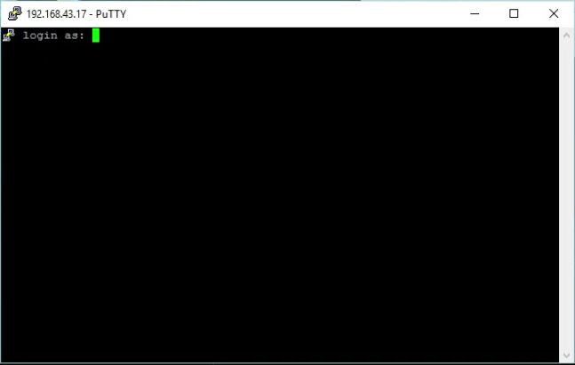

# MANUALE CENTOS
Guida per l' installazione dei principali servizi per la costruzione di un sistema di hosting:

- HTTP (php)
- MySql (+ phpMyAdmin)
- ftp


## Sistema
Macchina virtuale con SO:
CentOs 8
Emulata tramite Oracle VirtualBox 6.1.12


## Note iniziali
I servizi installati sono proposti nell'ordine di installazione effettuato (ciò non costituisce un vincolo, tranne in alcuni casi, ovviamente).

Per ogni servizio installato sono riportati tutti i passaggi, comandi utilizzati e configurazioni effettuate. Ogni volta sarà indicato il file di configurazione coinvolto ed ogni altro file utilizzato per lo scopo.

**NB:** *I comandi devono essere eseguiti con i privilegi amministrativi della macchina*

## Servizi
Scopi di CentOS:
- connessione di rete
- utente con privilegi amministrativi oltre all'utente root 

### *ssh*
##### File di configurazione
`/etc/ssh/sshd_config`<br/><br/>
Il comando eseguito in precedenza permette l' attivazione del servizio all'avvio del sistema. <br/>Il servizio se non diversamente configurato consente l'accesso da remoto a tutti gli utenti del sistema che possono fare login.<br/>Si può eseguire una sessione di testing utilizzando un client testuale ssh,dal server stesso o da programmi esterni come Putty o Termius
```
  yum install sshd
  systemctl start sshd
  systemctl enable sshd
```


##### Configurazione di ssh con impostazioni di sicurezza

Impediamo l' accesso da remoto all' utente amministratore (ROOT) e indichiamo a quali utenti potremo accedere da remoto.<br/>Dopo aver fatto una copia del file di configurazione si proceder&aacute; a impostare i seguenti comandi
```
  PermitRootLogin no
  AllowUsers ebeta
```
nell'esempio qui sopra, si permette l'accesso al solo utente ***ebeta***<br/>
Per applicare le modifiche riavviare il servizio: `systemctl restart sshd`

### *http*
Comadi di installazione e avvio del servizio:
```
  yum install httpd
  systemctl start httpd
  systemctl enable httpd
```
La ***DocumentRoot*** di Apache &eacute; `/var/www/html`
Configurare il firewall per permettere l'accesso alla porta di default del servizio (80/tcp) e il caricamento delle impostazioni
```
  firewall-cmd --permanent --add-port=80/tcp
  firewall-cmd --reload
```
Per testare il servizio via web browser da host remoto<br>
inserire nella barra di ricerca:<br>
`http://<ip_server>`

### *DBMS MySql*
Installazione del servizio (`Mysql-server`) e del client CLI (`mysql`)
```
  yum install mysql-server
  systemctl start mysqld
  systemctl enable mysqld
```
Esecuzione script per rimuovere alcune impostazioni di default pericolose:
- password dell'utente root del DBMS --> da impostare per proteggere l'accesso
- accesso utente anonimo --> da impedire
- accesso da remoto per l'utente root --> da impedire

```
  mysql_secure_installation
```
Testing del servizio da localhost con il client CLI
```
  mysql -u root -p
```
accede al dbms da root tramite la richiesta della password (-p)

### *PHP*
Installazione della versione di default e verifica della versione
```
  yum install php
  systemctl restart httpd
  php -v
```
Per testare il funzionamento di php creare un file `info.php`, nella ***DocumentRoot***, contenente il codice seguente (o uno script a propria scelta)
```
  <HTML>
    <HEAD></HEAD>
    <BODY>
      <?php phpinfo(); ?>
    </BODY>
  </HTML>
```
Testing via browser da host remoto `http://<ip_server>/info.php`

### *phpMyAdmin*
##### File di configurazione
`/etc/httpd/conf.d/phpMyAdmin.conf`<br/><br/>
Il package non è provvisto nelle repository di default di CentOS 8, quindi è necessario installare il repo aggiuntivo `EPEL repo` (Extra Packages for Enterprise Linux)
```
  yum install epel-release
```
Installazione di phpMyAdmin
```
  yum install phpmyadmin
```
-Testare il funzionamento via browser da host remoto `http://<ip_server>/phpmyadmin`<br/>
-Configurazione sulle politiche di accesso alle directory (fare una copia del file di configurazione originale).<br/>
Le impostazioni di default prevedono un accesso negato per qualsiasi connessione che non provenga dal server stesso (127.0.0.1). <br/>
Per accedere da remoto è necessario modificare tale impostazione e specificare l'indirizzo IP dell'host (o gli indirizzi) dal quale ci si vuole connettere.<br/>
-Per fare questo, nel file di configurazione sostiture tutte le stringhe `127.0.0.1` con l'ind IP della o delle macchine host.<br/>
-Testare il funzionamento via browser `http://<ip_server>/phpmyadmin` ed effettuare l'accesso utilizzando le credenziali dell'utente root del DBMS.<br/>


**Modifica degli alias di default**<br/>
`http://<ip_server>/phpmyadmin` e `http://<ip_server>/phpMyAdmin`<br/>
Nel file di configurazione mettere in commento gli alias di default e impostare un alias personalizzato
```
  # Alias /phpmyadmin /usr/share/phpMyAdmin
  # Alias /phpMyAdmin /usr/share/phpMyAdmin
  Alias /<mio_alias> /usr/share/phpMyAdmin
```
Sostituire `<mio_alias>` con la stringa scelta, come ad esempio `privdbms`<br/>
Testare il servizio con alias di default e con alias personalizzato

**Installare un prompt di autenticazione**<br/>
Apache fornisce questa funzionalità in modo nativo.
- Nel file di configurazione di phpMyAdmin impostare la direttiva `AllowOverride All`. La direttiva va inserita nel blocco `<Directory /usr/share/phpMyAdmin/>` prima degli altri blocchi presenti in esso.<br/>
- Riavviare il servizio
- Creare un file `.htaccess` in `/usr/sharephpMyAdmin` contenente le righe seguenti:<br/>
```
  AuthType Basic
  AuthName "Admin Login"
  AuthUserFile /etc/httpd/pma_pass
  Required valid-user
```
`AuthType Basic` specifica il tipo di autenticazione (con pwd utilizzando un file di pwd).<br/>
`AuthName "Admin Login"` specifica il msg per la dialog box (è opportuno tenere il msg generico per non far capire cosa si sta proteggendo).<br/>
`AuthUserFile /etc/httpd/pma_pass` specifica il file utilizzato per le pwd.<br/>
`Required valid-user` indica che possono accedere solo gli utenti autorizzati
- Creare e popolare il file password utilizzando l'utility `htpassword`<br/>
  ```
    htpassword -c /etc/httpd/pma_pass <nome_utente>
  ```
  l'opzione `-c` indica che il file deve essere creato (per ulteriori utenti **non** va specificata)<br/>
  `<nome_utente>` indica il nome dell'utente autorizzato ad accedere alla pagina di login. Sostituire con il nome dell'utente, ad es. `pippo`<br/>
  Premendo invio verr&aacute; richiesta la password da associare all'utente specificato

Testare il funzionamento.

### *ftp*
##### File di configurazione
`/etc/vsftp/vsftp.conf`<br/><br/>
Il server ftp utilizzato &eacute; VSFTP (Very Secure FTP).<br/>
Installazione e avvio del servizio
```
  yum install vsftpd
  systemctl start vsftpd
  systemctl enable vsftpd
```
impostazioni firewall
```
  firewall-cmd --permanent --add-service=ftp
  firewall-cmd --reload
```
Le impostazioni di default consentono l'accesso a utenti anonimi e a utenti di sistema. <br/>
Testing via web browser `ftp://<ip_server>`<br/>
Testing via client FileZilla (o altro client grafico) sia per utente anonimo (senza credenziali) sia per utente di sistema (username e pwd)<br/>
Testare il trasferimento file (upload e download) e la navigazione nel filesystem.<br/>
Il servizio può essere testato anche con client CLI ftp.

**Fare una copia del file di configurazione!**<br/>
Impostazioni per rendere più sicuro il servizio e permettere l'accesso ai soli utenti di sistema:
- impedire accesso utenti anonimi
- abilitare il chroot'ing (chroot jail)
- permettere agli utenti locali di poter scrivere nella propria home dir

```
  anonymous_enable=NO
  chroot_local_user=YES
  chroot_list_enable=YES
  allow_writeable_chroot=YES
  use_localtime=YES
```
creare il file vuoto `chroot_list`
```
  touch /etc/vsftpd/chroot_list
```
Testing ...<br/>
Se non funziona &eacute; necessario abilitare il boolean di SELinux `ftpd_full_access`
```
  setsebool -P ftpd_full_access on
```
Testing ...<br/>
**File di configurazione per le impostazioni correnti** `vsftpd.conf.01`
Abilitare l'uso delle porte passive
```
  pasv_enable=YES
  pasv_min_port=60000
  pasv_max_port=61000
```
Impostare il firewall per le porte passive
```
  firewall-cmd --permanent --add-port=60000-61000/tcp
  firewall-cmd --reload
```
Testing ...<br/>
Se non funziona abilitare boolean SELinux `ftpd_use_passive_mode`
```
  setsebool -P ftpd_use_passive_mode on
```
Testing ...<br/>
**File di configurazione per le impostazioni correnti** `vsftpd.conf.02`

Configurazione per utilizzare utenti virtuali (unicamente)<br/>
Fare una copia del file di configurazione<br/>
Installazione package `policycoreutils-python`
```
  yum install policycoreutils-python
```
Creare un file `/tmp/virtual-users.txt` contenente elenco utenti virtuali e relative password (il file pu&oacute; avere qualsiasi nome). Ogni utente occupa due righe: la prima per username e la seconda per la password.<br/>
File di esempio `/tmp/virtual-users.txt`:
```
  utente1
  centos1
  utente2
  centos2
```
Creazione del DB a partire dal file appena creato
```
  db_load -T -t hash -f /tmp/virtual-users.txt /etc/vsftpd/virtual-users.db
```
L'ultimo parametro del comando è il nome del file DB (si potrebbe anche utilizzare un DB MySQL...)

Creazione file PAM `/etc/pam.d/vsftpd-virtual` (il nome pu&oacute; essere quello che si vuole ma non `vsftpd`) che user&aacute; il DB appena creato per validare gli utenti virtuali.<br/>Nel file `/etc/pam.d/vsftpd-virtual`
```
  auth required pam_userdb.so db=/etc/vsftpd/virtual-users
  account required pam_userdb.so db=/etc/vsftpd/virtual-users
```
Per ogni utente virtuale si crea una dir nella `DocumentRoot` di Apache, si assegna la ownership a ftp, si informa SELinux di consentire accesso in letura/scrittura al di fuori della home dir tipica (`/home`).<br/>
L'esempio che segue &eacute; per l'utente `utente1` (replicare le parti necessarie per l'utente utente2)
```
  mkdir -p /var/www/html/sito01
  chown ftp: /var/www/html/sito01
  setsebool -P allow_ftpd_full_access_on
  semanage fcontext -a -t public_content_rw_t "/var/www/html(/.*)?"
  restorecon -R -v /var/www/html
```

Modfica del file di configurazione `/etc/vsftpd/vsftpd.conf`.<br/>
Commentare
```
  #pam_service_name=vsftpd
```
Aggiungere in fondo al file
```
  pam_service_name=vsftpd-virtual
  virtual_use_local_privs=YES
  guest_enable=YES
  user_sub_token=$USER
  local_root=/var/www/html/$USER
  hide_ids=YES
```
Riavviare il servizio
```
  systemctl restart vsftpd
```
Rimuovere il file temporaneo `/tmp/virtual-users.txt`<br/>
Proteggere il file db `/etc/vsftpd/virtual-users.db`
```
  rm /tmp/virtual-users.txt
  chmod 600 /etc/vsftpd/virtual-users.db
```
Testing del servizio con FileZilla e gli utenti virtuali...<br/>
